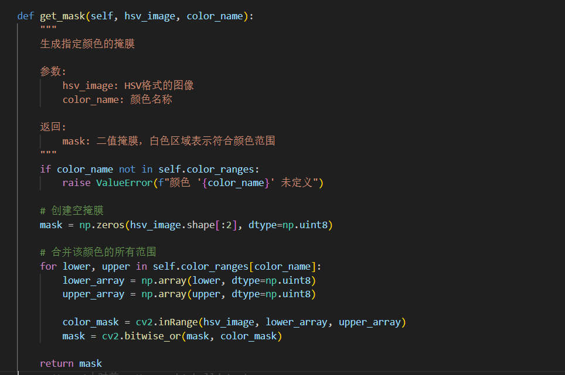
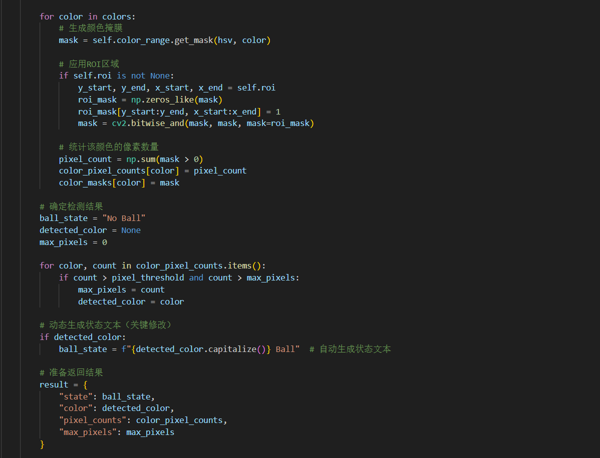

# Assignment1-Balldetect
>24-海洋装备-胡景裕

## 1、目录结构
+ 工作目录：Homework
+ algorithm: 放置核心的Balldetect和ColorRange类的脚本
+ config：放置用于导入HSV颜色范围，ROI区域等信息的配置文件
+ data: 放置作业中要用到的所有视频和图片文件
+ other_tools：做作业时用到的其他辅助脚本工具，与主脚本无联系

在Homework目录下，写了一个main脚本，该脚本用于直接演示该项目的流程和输出结果（两个output_result）以及输出视频的一些信息。其中，main脚本通过调用algorithm中的两个类来完成这个流程而不是把两个类全部写在一个脚本中，避免代码冗杂不便于观看。

## 2、代码思路
### （一）ColorRange
该类包含一个构造方法和多个功能的方法，核心思路是：管理器的**属性只有一个字典**，用于存储所有要生成的掩膜的颜色名字及其对应的HSV范围（同一个颜色也可以有多个不连续范围），方法则有多种对该字典的操作方法，包括**增加、移除、清空、显示**存储在字典中的HSV范围信息，并配有load方法用于加载配置文件。最后，通过**get_mask和get_combined_mask方法**对图像处理来获取目标掩膜。

#### 示例1：属性——字典
字典的大致存储格式：
```python
{"red":[
        ((0,200,200)，(20,255,255)),
        ((160,100,100),(180,255,255))  #此处红色设置了两个范围
 ]

 "blue":[((110,100,100),(130,255,255))
 ]

 "purple":[((140,100,100),(170,255,255))

 ]
}
```
字典中每个颜色存储为一个集合，集合中存放多个元组表示多个范围，每个元组中嵌套两个元组，分别表示颜色范围的下限和上限。

#### 示例2：生成掩膜


先生成一个空掩膜，然后通过循环结构逐个提取字典中目标颜色的各个范围并生成掩膜，把这些掩膜逐个与空掩膜合并得到最终的掩膜。

### （二）BallDetector
该类的构造方法中除了设置一些参数外，**把ColorRange类的实例作为一个属性方便内部调用**，并直接把ColorRange的一些方法搬过来便于通过balldetector实例来调控colorrange实例的一些参数。其他一些方法，有设置、清除ROI区域，逐帧和视频处理的方法，并且结尾有一个析构函数用于释放空间。其余一些细节，可以自行看代码。

**核心部分**，即识别每一帧的球的情况的思路是：
* 通过属性中的ColorRange的实例生成这一帧的每个目标颜色的掩膜（通过配置文件识别有哪些颜色及其范围）
* 通过指定的ROI区域筛选掩膜范围：只有区域内的掩膜保留其他设为0
* 计算筛选的颜色掩膜中，判断哪种颜色像素最多并记录这个像素最大值
* 设置一个像素阈值，只有当像素最大值超过这个阈值时才判断检测到球，否则判断没检测到球（避免背景一些小范围的掩膜导致误判）
* 显示结果：左上角显示是否检测到球和检测到哪种颜色的球

关键代码段：


### （三）配置文件
一共存储三种信息：

>HSV颜色范围


>ROI范围


>像素阈值（balldetector中检测是否有球）

## 3、遇到的困难
前面写流程的部分还好，看一下讲义，问一下AI很快就能弄好。但是为了按照作业要求，在高光背景下识别球时，如果想尽可能地只保留球的部分且避免背景影响的误判，需要特别考虑HSV颜色范围的配置，然而目前对HSV空间的理解还不够深入，找合适的HSV范围时只能靠枚举法，有点费力。也许还有更高效的方法？

